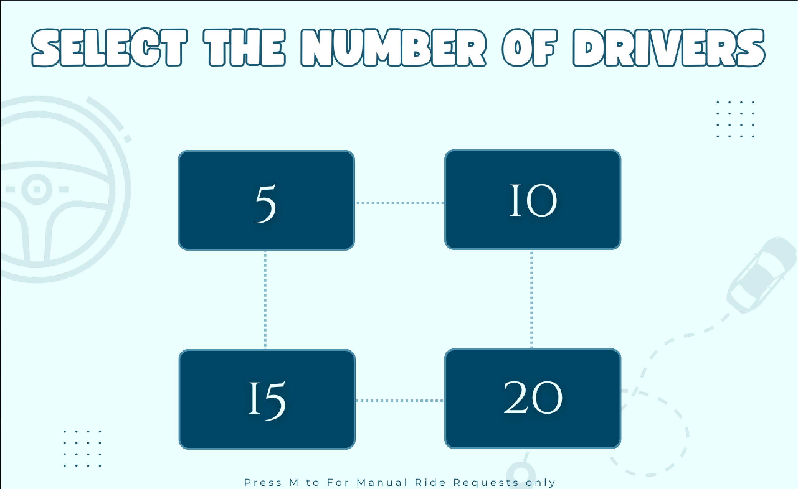
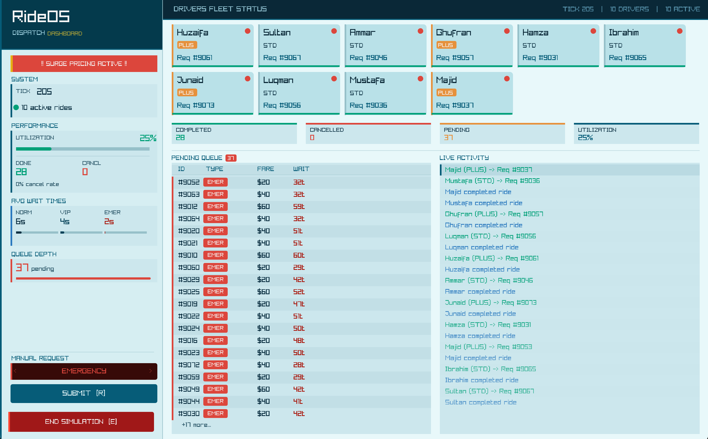
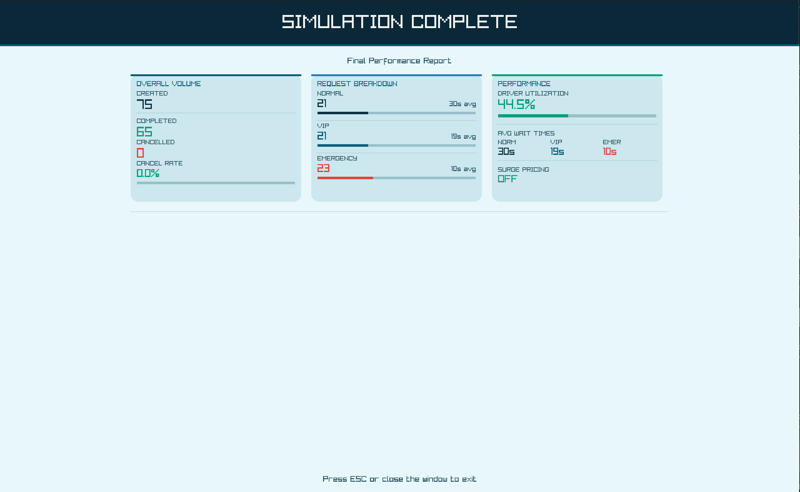

# RideOS: An Autonomous Ride Sharing Dispatch System

RideOS is a concurrent system designed to simulate the complexities of a real-time ride-sharing dispatch environment. The project demonstrates advanced Operating Systems concepts, including multithreading, inter-process communication (IPC), and synchronization primitives. It utilizes a dual-process architecture to decouple backend dispatch logic from the frontend graphical user interface.

## Group Members

| Name | ID |
| :--- | :--- |
| Ali Kashif | 24K-0802 |
| Ismail Silat | 24K-0546 |
| Hammad Abdul Rahim | 24K-0581 |

## Core Technical Features

- **Multithreaded Dispatch Engine**: Implements a producer-consumer model using POSIX threads (pthreads) to manage incoming ride requests and driver assignments concurrently.
- **Priority-Based Scheduling & Aging**: Features a robust scheduling algorithm that prioritizes Emergency and VIP requests. It incorporates an aging mechanism to prevent process starvation for standard requests.
- **Advanced Synchronization**: Ensures data integrity across threads using Mutexes for mutual exclusion and Condition Variables for thread signaling and coordination.
- **Inter-Process Communication (IPC)**:
    - **Named Pipes (FIFOs)**: Used for reliable message passing from the Request Server to the Main Server.
    - **POSIX Shared Memory & Semaphores**: Facilitates high-speed state synchronization between processes, protected by semaphores to prevent race conditions during concurrent access.
- **Signal Handling & Graceful Shutdown**: Both processes handle `SIGINT` to trigger coordinated, clean teardown — releasing pipes, shared memory, and semaphores without resource leaks. The GUI can forward `SIGINT` to the backend via `kill(mainPid, SIGINT)`, and the backend can initiate shutdown by setting a `shutdownFlag` in shared memory that the GUI polls.
- **Real-Time Resource Monitoring**: A Raylib-based dashboard that visualizes driver states (Idle, Busy, Offline) and pending request queues.

## Operational Workflow

1. **Request Generation**: The Request Server hosts a background thread that generates random `PipeRequest` structures or accepts manual user input.
2. **IPC Transmission**: Messages are serialized and transmitted through a named pipe (`/tmp/rideos_pipe`) to the Main Server.
3. **Thread Orchestration**: Upon receiving a request, the Main Server spawns a dedicated **Request Thread** to manage the lifecycle of that specific customer.
4. **Priority Queuing**: Requests are inserted into a synchronized priority queue. The **Dispatcher Thread** constantly monitors the queue and the available **Driver Pool**.
5. **Synchronization**: When a driver is matched, the Dispatcher uses `pthread_cond_signal` to wake the waiting Request Thread, which then hands off control to a **Ride Thread** to simulate the trip duration.
6. **State Synchronization**: The Main Server continuously updates a **Shared Memory** segment (`/rideos_shm`) with the latest fleet telemetry, which the Request Server reads to update the GUI at 60 FPS.

## Signal Handling & Graceful Shutdown

Both servers implement `SIGINT` handling so either process can trigger a clean, coordinated shutdown from the terminal.

**Shutting down via the GUI (`request_server_bin`):**
Sending `SIGINT` (Ctrl-C) sets an internal `g_sigintReceived` flag. The GUI loop exits through the same cleanup path used when the Raylib window is closed — closing pipes, shared memory, and semaphores — then forwards `SIGINT` to the Main Server using the `mainPid` read from shared memory, causing both processes to exit cleanly.

**Shutting down via the backend (`main_server_bin`):**
Sending `SIGINT` (Ctrl-C) causes the Main Server to set a `shutdownFlag` in shared memory. The Request Server detects this on its next polling cycle, captures the final metrics, calls `generatorStop()`, transitions the GUI to the metrics screen, and then performs its usual IPC cleanup before exiting.

**Testing both paths:**

```bash
# Terminal 1
./main_server_bin

# Terminal 2
./request_server_bin
```

- Press Ctrl-C in the **Request Server** terminal → GUI cleans up and forwards SIGINT to the backend.
- Press Ctrl-C in the **Main Server** terminal (or run `kill -SIGINT <pid>`) → backend sets `shutdownFlag`; GUI detects it, shows final metrics, then exits.

## Visual Interface

### 1. Intro Screen
The landing interface featuring the deterministic dispatch wordmark and entry button.


### 2. Configuration & Drivers' Fleet Selection
Users select the initial drivers' fleet size to initialize the global driver pool.


### 3. Real-Time Dashboard
The primary monitoring interface displaying driver status cards, pending queues, and live activity logs.


### 4. Performance Metrics
A summarized report generated upon simulation termination, displaying system efficiency and wait time analytics.


## Build and Execution

### Prerequisites
The system is designed for Linux-based environments (or WSL on Windows) and requires:
- **GCC**: C11 standard support.
- **Raylib**: Version 4.5 or higher.
- **Pthreads**: POSIX thread library.
- **Realtime Extensions**: `lrt` library for shared memory and semaphores.

### Compilation
```bash
make clean
make
```
This generates two executables: `main_server_bin` and `request_server_bin`.

### Execution Sequence
To ensure IPC channels are correctly initialized, follow this exact order:

1. **Start the Backend (Main Server)**
   ```bash
   ./main_server_bin
   ```
   The server initializes the driver pool and dispatcher, then waits for a configuration message from the GUI.

2. **Launch the GUI (Request Server)**
   ```bash
   ./request_server_bin
   ```
   Press `S` or the Start button, then select your driver count to begin the simulation.

## User Interface Controls

| Key | Function |
| :--- | :--- |
| **R** | Submit a manual request into the IPC pipe |
| **TAB** | Cycle through request priority levels (Normal, VIP, Emergency) |
| **E** | Trigger simulation termination and generate metrics report |
| **ESC** | Graceful shutdown and resource cleanup |
| **Ctrl-C** | Signal-based graceful shutdown (see Signal Handling above) |